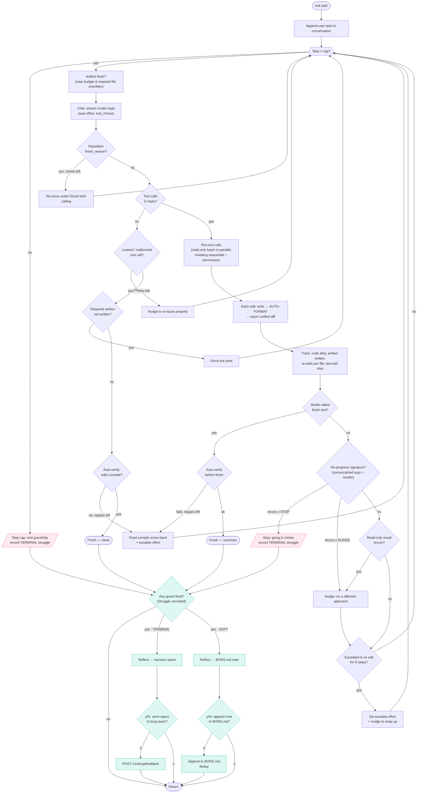

# borg agent loop — how it works

This is the control flow of `Agent.Ask` (`internal/agent/loop.go`): the loop that
sends the conversation to the model, runs the tool calls it asks for, feeds the
results back, and repeats until the task is done — with a stack of recovery
backstops so a small model can't strand, loop, or self-destruct.

## Why Mermaid (and how to export)

The diagram below is **Mermaid**, not a committed `.svg`, on purpose: it's plain
text (editable, diffable, reviewable in a PR) and renders to SVG anywhere.

- **GitHub / VS Code**: render inline automatically (VS Code: the built-in Markdown
  preview, or the "Markdown Preview Mermaid" extension).
- **Export to SVG/PNG**:
  ```bash
  npx -y @mermaid-js/mermaid-cli -i dev/agent-loop.md -o dev/agent-loop.svg
  ```
  (`mmdc` extracts every ```mermaid block; use `-o out.svg` for one diagram.)

If you'd rather have a single editable source that *is* SVG, the usual alternatives
are [Excalidraw](https://excalidraw.com) (`.excalidraw` JSON, exports SVG) or
[draw.io](https://draw.io) (`.drawio` XML) — but those are binary-ish and don't
diff well in review, so Mermaid is the recommended format for a flow that lives
next to the code.

## The loop



## Node-by-node

**Per-step entry**
- **Ask task / append** — the user's task is appended to the running conversation;
  the whole conversation is re-sent every step (so context hygiene matters).
- **Step < cap?** — `defaultMaxSteps` (60) is a high backstop, not a task budget;
  real loops are caught earlier. Hitting it ends gracefully *with the work so far*
  and records a **terminal** struggle.
- **Artifact flush** — if the task *requires* a file (e.g. `/learn` → BORG.md) and
  budget (steps or context window) is nearly out, force the write now so a broad run
  ends *with* the deliverable.
- **Chat** — one streamed model turn. Ordinary turns run on the model's `auto`
  tool-choice (so plain answers still stream); only a turn following a detected leak
  is forced to `required`. Reasoning effort starts cheap and is raised only on hard
  signals.

**No-tools branches (the model replied without calling a tool)**
- **Repetition guard** — the stream guard cut a degenerate prose loop ("Wait…
  Actually…"); re-issue under forced tool-calling, bounded by `maxRepetitionRetries`.
- **Leaked / malformed tool call** — gemma-class models sometimes emit a tool call
  as *text*; `finish_reason=malformed_function_call` or a sniffed text leak triggers
  a bounded re-prompt (`maxLeakRetries`).
- **Required artifact not written** — the model tried to finish but never wrote the
  file the task demands; force the write.
- **Auto-verify (finish path)** — before a turn that edited source can end, the loop
  runs the compile check itself; on FAIL it feeds the errors back (and bumps effort),
  bounded by `maxAutoVerifyRepairs`. This closes the read→edit→build loop like Claude
  Code's PostToolUse hook.

**Tool branch (the model called tools)**
- **Run tool calls** — independent read-only calls run **concurrently**; any mutating
  tool forces sequential, ordered execution behind a permission prompt.
- **Auto-format** — every successful edit is written, then formatted with the
  project's own formatter (gofmt / Prettier / Pint / Black / rustfmt / …, or the
  `format` override), and the tool returns a **unified diff** of the final result.
  This removes the small model's biggest time-sink: getting whitespace byte-perfect.
- **Track** — code-dirty (arms auto-verify), artifact-written, per-file re-edit count
  (re-edit thrash signal), and last-edit step (for the circuit breaker).

**Loop guards (after a tool step)**
- **No-progress signature** — a per-step signature of **canonicalized** tool args +
  results; if it recurs within a window it's a loop. Nudge once, then **stop**
  (terminal). Canonicalization is load-bearing: it collapses the same grep with a
  reshuffled `a|b|c` alternation, which once defeated this guard and burned 1.45M
  tokens.
- **Read-only result net** — read-only steps whose *results* recur (different args,
  same `(no matches)`) get a nudge the arg-signature can miss.
- **Escalation circuit breaker** — once effort is escalated, if many steps pass with
  no successful edit, drop back to the cheap default and nudge to wrap up, so a
  stuck-but-distinct trajectory can't burn expensive steps to the cap.

**Self-heal retrospective (after the loop ends)**
- **Any guard fired?** — if a `Struggle` was recorded, run **one** reflection call;
  otherwise return silently (the common case).
- **Severity split** — a **terminal** give-up → a **harness report** to the borg team
  (reporting is reserved for genuine dead-ends); a **soft** thrash-but-finished → a
  **BORG.md note** (or `NONE`, to avoid bloat — the reflection sees existing lessons
  and `ApplyRetroLearn` dedups).
- **Consent** — both paths show the **exact** text in a y/N modal before anything is
  written to BORG.md or POSTed to `/v1/borg/feedback`. Nothing leaves the machine
  without an explicit yes.
